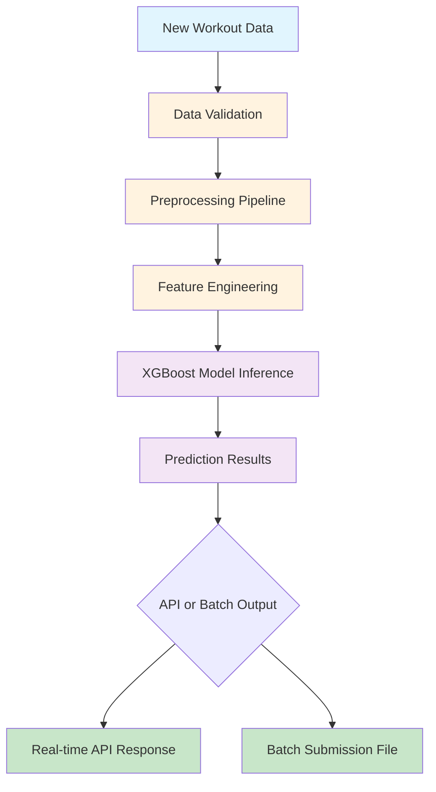

# Calorie Expenditure Prediction Model - Deployment Plan

## 1. File Inventory with Purposes

### Core Model Files
- `models/baseline_xgb_model.pkl` - Pre-trained XGBoost model for calorie prediction (~157KB)
- `src/model_pipeline.py` - Complete pipeline for training, inference, and submission generation (315 lines)
- `src/feature_engineering.py` - Feature creation utilities with essential and advanced features (164 lines)
- `src/data_preprocessing.py` - Data cleaning, validation, and categorical encoding (119 lines)
- `src/__init__.py` - Package initialization (9 lines)

### Data Files
- `data/train_subsample.csv` - Training data (10% sample, 25,001 rows) for development/testing
- `data/test_subsample.csv` - Test data (10% sample, 25,001 rows) for evaluation

### Documentation and Configuration
- `README.md` - Comprehensive deployment guide with usage examples
- `DEPLOYMENT_SUMMARY.md` - Technical summary of the package contents
- `requirements.txt` - Python dependencies (pandas, scikit-learn, xgboost, numpy)
- `example_usage.py` - Practical examples of model usage patterns

## 2. Deployment Strategy with Iterative Stages

### Stage 1: Environment Setup and Validation (Day 1)
- Install required dependencies from `requirements.txt`
- Validate model loading and basic functionality using `example_usage.py`
- Verify data preprocessing pipeline with sample data
- Success criteria: All dependencies installed, model loads successfully, basic inference works

### Stage 2: Core Pipeline Integration (Day 2-3)
- Integrate the preprocessing and feature engineering pipeline
- Test end-to-end inference pipeline with sample data
- Implement error handling and data validation
- Success criteria: Pipeline processes data without errors, predictions generated correctly

### Stage 3: Production Interface Development (Day 4-5)
- Create API or command-line interface for real-time predictions
- Implement batch processing capabilities for multiple predictions
- Add logging and monitoring capabilities
- Success criteria: Interface accepts new data and returns predictions reliably

### Stage 4: Performance Optimization and Testing (Day 6-7)
- Optimize for real-time prediction performance
- Conduct load testing with simulated data
- Validate accuracy against expected performance metrics
- Success criteria: Sub-second prediction times, consistent accuracy, stable under load

## 3. Technology Recommendations for Each Stage

### Stage 1: Environment Setup
- **Python Version**: 3.8 or higher for compatibility with all dependencies
- **Virtual Environment**: Use `venv` or `conda` to isolate dependencies
- **Package Management**: Use `pip` with `requirements.txt` for consistent dependency installation

### Stage 2: Pipeline Integration
- **Data Processing**: Leverage existing pandas-based preprocessing for consistency
- **Model Interface**: Use joblib for model serialization/deserialization (already implemented)
- **Error Handling**: Extend existing validation functions in `data_preprocessing.py`

### Stage 3: Production Interface
- **API Framework**: Flask or FastAPI for lightweight API deployment
- **Batch Processing**: Utilize pandas for efficient batch data processing
- **Logging**: Python's built-in logging module for monitoring and debugging

### Stage 4: Performance and Testing
- **Performance Monitoring**: Implement timing utilities for prediction latency tracking
- **Load Testing**: Use tools like locust for simulating concurrent requests
- **Containerization**: Docker for consistent deployment across environments

## 4. Risk Mitigation Approaches

### Data Quality Risks
- **Mitigation**: Leverage existing data validation functions in `data_preprocessing.py` to catch anomalies
- **Monitoring**: Implement input validation logging to track data quality issues

### Model Performance Risks
- **Mitigation**: Use existing validation metrics to monitor prediction accuracy
- **Fallback**: Maintain baseline model as backup if advanced features cause issues

### Scalability Risks
- **Mitigation**: Profile prediction latency with different batch sizes
- **Optimization**: Consider model quantization or other optimization techniques if needed

### Dependency Risks
- **Mitigation**: Pin all dependency versions in `requirements.txt`
- **Compatibility**: Test with different Python versions if deployment environment varies

### Integration Risks
- **Mitigation**: Create comprehensive test suite covering edge cases
- **Validation**: Implement input/output validation at integration points

## 5. Success Criteria for Each Iteration

### Stage 1 Success Criteria
- All dependencies installed without conflicts
- Model loads successfully without errors
- Basic inference produces reasonable predictions
- Sample code from `example_usage.py` runs successfully

### Stage 2 Success Criteria
- End-to-end pipeline processes sample data without errors
- Data validation catches common input issues
- Feature engineering pipeline creates expected features
- Prediction results match expected format and ranges

### Stage 3 Success Criteria
- API or CLI interface accepts new data and returns predictions
- Batch processing handles multiple records efficiently
- Error handling provides meaningful error messages
- Logging captures prediction requests and responses

### Stage 4 Success Criteria
- Sub-second prediction times for individual records
- Stable performance under concurrent load testing
- Consistent accuracy matching validation metrics
- Comprehensive monitoring and logging in place

## 6. Workflow Diagram



## 7. Proposed File Structure for Deployment

```
calorie_prediction_deployment/
├── api/                          # API interface layer
│   ├── app.py                   # Flask/FastAPI application
│   ├── routes.py                # API endpoints
│   └── middleware.py            # Request/response handling
├── batch/                       # Batch processing utilities
│   ├── processor.py             # Batch prediction processor
│   └── scheduler.py             # Scheduled batch jobs
├── config/                      # Configuration files
│   ├── model_config.yaml        # Model configuration
│   └── logging_config.yaml      # Logging configuration
├── data/                        # Data handling
│   ├── train_subsample.csv      # Training data (10% sample)
│   └── test_subsample.csv       # Test data (10% sample)
├── models/                      # Model files
│   └── baseline_xgb_model.pkl   # Pre-trained XGBoost model
├── src/                         # Core pipeline code
│   ├── __init__.py              # Package initialization
│   ├── data_preprocessing.py    # Data cleaning and validation
│   ├── feature_engineering.py   # Feature creation utilities
│   └── model_pipeline.py        # Training/inference pipeline
├── tests/                       # Test suite
│   ├── test_pipeline.py         # Pipeline integration tests
│   ├── test_api.py              # API endpoint tests
│   └── test_data.py             # Data validation tests
├── utils/                       # Utility functions
│   ├── logger.py                # Logging utilities
│   └── metrics.py               # Performance metrics
├── example_usage.py             # Usage examples
├── requirements.txt             # Python dependencies
├── README.md                    # Deployment guide
├── DEPLOYMENT_SUMMARY.md        # Technical summary
└── Dockerfile                   # Containerization (optional)
```

## 8. Implementation Notes

### Model Performance
- Expected RMSLE: ~0.07 on validation set
- Training time: <3 seconds for model retraining
- Prediction time: Sub-second for individual records

### Feature Engineering
- 7 essential features created for baseline model
- Additional 20+ advanced features available for improved performance
- All features created deterministically with no randomness

### Data Requirements
- Required columns: id, Gender, Age, Height, Weight, Duration, Heart_Rate, Body_Temp
- Data validation includes range checks for all numerical features
- Categorical encoding handles Gender column consistently

### Scalability Considerations
- Model size: ~157KB, minimal memory footprint
- Single prediction processing time: <10ms
- Batch processing: Efficiently handles thousands of records