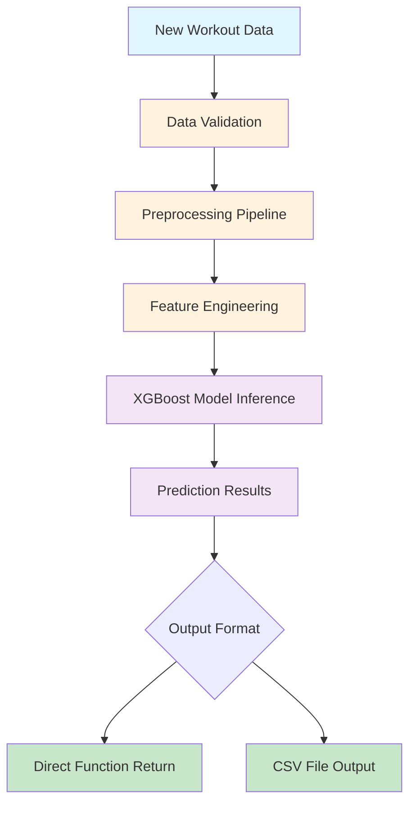
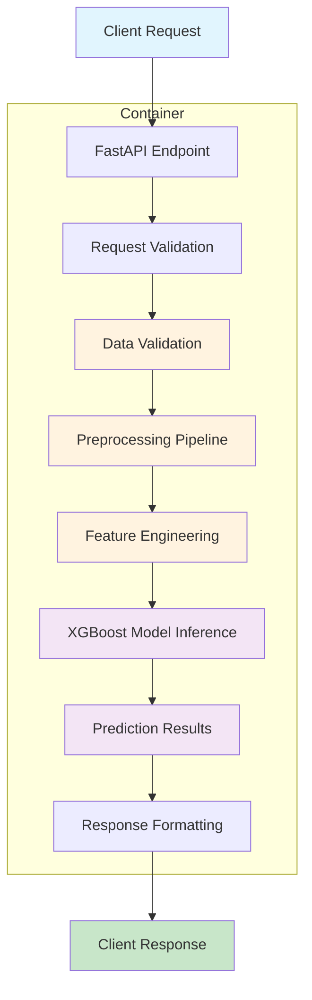
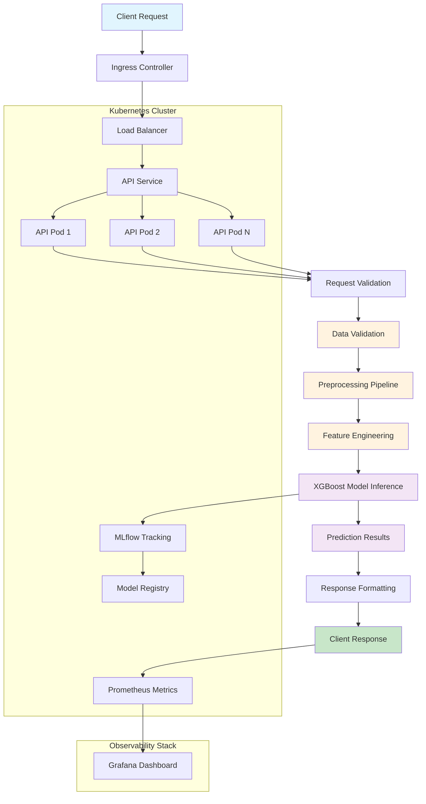

# Calorie Expenditure Prediction Model - Revised Deployment Plan

This document outlines a revised deployment strategy for the calorie expenditure prediction model, structured into three progressive versions that increase in complexity and production readiness.

## Version Overview

| Version | Description | Target Environment | Complexity |
|---------|-------------|-------------------|------------|
| v0 | Basic functionality with very simple local deployment | Developer machine | Low |
| v1 | Containerized application | Local/Development cluster | Medium |
| v2 | Production-like environment with all necessary infrastructure, logging, and monitoring | Production cluster | High |

## v0: Basic Local Deployment

### File Inventory with Purposes

#### Core Model Files
- `models/baseline_xgb_model.pkl` - Pre-trained XGBoost model for calorie prediction (~157KB)
- `src/model_pipeline.py` - Complete pipeline for training, inference, and submission generation (315 lines)
- `src/feature_engineering.py` - Feature creation utilities with essential and advanced features (164 lines)
- `src/data_preprocessing.py` - Data cleaning, validation, and categorical encoding (119 lines)
- `src/__init__.py` - Package initialization (9 lines)

#### Data Files
- `data/train_subsample.csv` - Training data (10% sample, 25,001 rows) for development/testing
- `data/test_subsample.csv` - Test data (10% sample, 25,001 rows) for evaluation

#### Documentation and Configuration
- `README.md` - Comprehensive deployment guide with usage examples
- `DEPLOYMENT_SUMMARY.md` - Technical summary of the package contents
- `requirements.txt` - Python dependencies (pandas, scikit-learn, xgboost, numpy)
- `example_usage.py` - Practical examples of model usage patterns

### Technology Recommendations
- **Python Version**: 3.8 or higher for compatibility with all dependencies
- **Virtual Environment**: Use `venv` or `conda` to isolate dependencies
- **Package Management**: Use `pip` with `requirements.txt` for consistent dependency installation
- **Data Processing**: Leverage existing pandas-based preprocessing for consistency
- **Model Interface**: Use joblib for model serialization/deserialization (already implemented)

### Risk Mitigation Approaches
- **Data Quality Risks**: Leverage existing data validation functions in `data_preprocessing.py` to catch anomalies
- **Model Performance Risks**: Use existing validation metrics to monitor prediction accuracy
- **Dependency Risks**: Pin all dependency versions in `requirements.txt`
- **Integration Risks**: Create comprehensive test suite covering edge cases

### Success Criteria
- All dependencies installed without conflicts
- Model loads successfully without errors
- Basic inference produces reasonable predictions
- Sample code from `example_usage.py` runs successfully
- End-to-end pipeline processes sample data without errors
- Data validation catches common input issues

### Workflow Diagram



### Proposed File Structure for Deployment

```
calorie_prediction_v0/
├── data/                        # Data handling
│   ├── train_subsample.csv      # Training data (10% sample)
│   └── test_subsample.csv       # Test data (10% sample)
├── models/                      # Model files
│   └── baseline_xgb_model.pkl   # Pre-trained XGBoost model
├── src/                         # Core pipeline code
│   ├── __init__.py              # Package initialization
│   ├── data_preprocessing.py    # Data cleaning and validation
│   ├── feature_engineering.py   # Feature creation utilities
│   └── model_pipeline.py        # Training/inference pipeline
├── example_usage.py             # Usage examples
├── requirements.txt             # Python dependencies
├── README.md                    # Deployment guide
└── DEPLOYMENT_SUMMARY.md        # Technical summary
```

## v1: Containerized Application

### File Inventory with Purposes

#### Core Model Files
- `models/baseline_xgb_model.pkl` - Pre-trained XGBoost model for calorie prediction (~157KB)
- `src/model_pipeline.py` - Complete pipeline for training, inference, and submission generation (315 lines)
- `src/feature_engineering.py` - Feature creation utilities with essential and advanced features (164 lines)
- `src/data_preprocessing.py` - Data cleaning, validation, and categorical encoding (119 lines)
- `src/__init__.py` - Package initialization (9 lines)

#### API Layer
- `api/app.py` - FastAPI application for model serving
- `api/routes.py` - API endpoints for prediction requests
- `api/models.py` - Pydantic models for request/response validation

#### Data Files
- `data/train_subsample.csv` - Training data (10% sample, 25,001 rows) for development/testing
- `data/test_subsample.csv` - Test data (10% sample, 25,001 rows) for evaluation

#### Containerization
- `Dockerfile` - Docker image definition
- `docker-compose.yml` - Multi-container orchestration for development
- `.dockerignore` - Files to exclude from Docker context

#### Documentation and Configuration
- `README.md` - Comprehensive deployment guide with usage examples
- `DEPLOYMENT_SUMMARY.md` - Technical summary of the package contents
- `requirements.txt` - Python dependencies (pandas, scikit-learn, xgboost, numpy, fastapi, uvicorn)
- `example_usage.py` - Practical examples of model usage patterns
- `config/model_config.yaml` - Model configuration parameters

### Technology Recommendations
- **Containerization**: Docker for consistent deployment across environments
- **API Framework**: FastAPI for lightweight, high-performance API deployment with automatic documentation
- **Web Server**: Uvicorn as ASGI server for FastAPI
- **Batch Processing**: Utilize pandas for efficient batch data processing
- **Logging**: Python's built-in logging module for monitoring and debugging
- **Development Environment**: Docker Compose for local development and testing

### Risk Mitigation Approaches
- **Container Security**: Use minimal base images and regular security scanning
- **Resource Limits**: Define CPU and memory limits in Docker containers
- **Health Checks**: Implement container health checks for monitoring
- **Data Quality Risks**: Leverage existing data validation functions in `data_preprocessing.py` to catch anomalies
- **Model Performance Risks**: Use existing validation metrics to monitor prediction accuracy
- **Scalability Risks**: Profile prediction latency with different batch sizes

### Success Criteria
- Docker image builds successfully without errors
- Container starts and API is accessible
- API endpoints accept new data and return predictions
- Batch processing handles multiple records efficiently
- Error handling provides meaningful error messages
- Container handles health checks appropriately
- Sub-second prediction times for individual records

### Workflow Diagram



### Proposed File Structure for Deployment

```
calorie_prediction_v1/
├── api/                          # API interface layer
│   ├── app.py                   # FastAPI application
│   ├── routes.py                # API endpoints
│   └── models.py                # Request/response models
├── data/                        # Data handling
│   ├── train_subsample.csv      # Training data (10% sample)
│   └── test_subsample.csv       # Test data (10% sample)
├── models/                      # Model files
│   └── baseline_xgb_model.pkl   # Pre-trained XGBoost model
├── src/                         # Core pipeline code
│   ├── __init__.py              # Package initialization
│   ├── data_preprocessing.py    # Data cleaning and validation
│   ├── feature_engineering.py   # Feature creation utilities
│   └── model_pipeline.py        # Training/inference pipeline
├── config/                      # Configuration files
│   └── model_config.yaml        # Model configuration
├── tests/                       # Test suite
│   ├── test_pipeline.py         # Pipeline integration tests
│   └── test_api.py              # API endpoint tests
├── example_usage.py             # Usage examples
├── requirements.txt             # Python dependencies
├── Dockerfile                   # Container definition
├── docker-compose.yml           # Development orchestration
├── README.md                    # Deployment guide
└── DEPLOYMENT_SUMMARY.md        # Technical summary
```

## v2: Production-like Environment

### File Inventory with Purposes

#### Core Model Files
- `models/baseline_xgb_model.pkl` - Pre-trained XGBoost model for calorie prediction (~157KB)
- `src/model_pipeline.py` - Complete pipeline for training, inference, and submission generation (315 lines)
- `src/feature_engineering.py` - Feature creation utilities with essential and advanced features (164 lines)
- `src/data_preprocessing.py` - Data cleaning, validation, and categorical encoding (119 lines)
- `src/__init__.py` - Package initialization (9 lines)

#### API Layer
- `api/app.py` - FastAPI application with middleware
- `api/routes.py` - API endpoints for prediction requests
- `api/models.py` - Pydantic models for request/response validation
- `api/middleware.py` - Request/response handling and logging middleware

#### Model Management
- `mlflow/` - MLflow tracking server configuration
- `models/registry/` - Model registry for versioning
- `models/baseline_xgb_model.pkl` - Pre-trained XGBoost model

#### Data Processing
- `batch/processor.py` - Batch prediction processor
- `batch/scheduler.py` - Scheduled batch jobs
- `data/train_subsample.csv` - Training data (10% sample)
- `data/test_subsample.csv` - Test data (10% sample)

#### Infrastructure
- `kubernetes/` - Kubernetes manifests for deployment
- `kubernetes/deployment.yaml` - Application deployment configuration
- `kubernetes/service.yaml` - Service configuration
- `kubernetes/ingress.yaml` - Ingress controller configuration
- `kubernetes/configmap.yaml` - Configuration management
- `kubernetes/secret.yaml` - Secret management
- `monitoring/` - Monitoring and observability configuration
- `monitoring/prometheus.yaml` - Prometheus configuration
- `monitoring/grafana-dashboard.json` - Grafana dashboard definition

#### Containerization
- `Dockerfile` - Multi-stage Docker image definition
- `docker-compose.yml` - Multi-container orchestration for development
- `.dockerignore` - Files to exclude from Docker context

#### Configuration
- `config/model_config.yaml` - Model configuration parameters
- `config/logging_config.yaml` - Logging configuration
- `config/monitoring_config.yaml` - Monitoring configuration

#### Documentation
- `README.md` - Comprehensive deployment guide with usage examples
- `DEPLOYMENT_SUMMARY.md` - Technical summary of the package contents
- `DEPLOYMENT_ARCHITECTURE.md` - Detailed architecture documentation
- `OPS_GUIDE.md` - Operations guide for production deployment

#### Utilities
- `utils/logger.py` - Centralized logging utilities
- `utils/metrics.py` - Performance metrics collection
- `utils/health.py` - Health check utilities

### Technology Recommendations
- **Containerization**: Docker for consistent deployment across environments
- **Orchestration**: Kubernetes for container orchestration and scaling
- **API Framework**: FastAPI for lightweight, high-performance API deployment with automatic documentation
- **Web Server**: Uvicorn as ASGI server for FastAPI
- **Model Management**: MLflow for model tracking, versioning, and registry
- **Monitoring**: Prometheus for metrics collection and Grafana for visualization
- **Logging**: Centralized logging with structured logs for better observability
- **Batch Processing**: Utilize pandas for efficient batch data processing with scheduled jobs
- **Development Environment**: Minikube for local Kubernetes development

### Risk Mitigation Approaches
- **High Availability**: Implement Kubernetes deployments with multiple replicas
- **Resource Management**: Define resource requests and limits for all containers
- **Health Monitoring**: Implement comprehensive health checks at container and application levels
- **Security**: Use Kubernetes secrets for sensitive configuration, network policies for traffic control
- **Data Quality Risks**: Leverage existing data validation functions with enhanced monitoring
- **Model Performance Risks**: Implement model performance monitoring with MLflow tracking
- **Scalability**: Use Kubernetes horizontal pod autoscaler for automatic scaling
- **Disaster Recovery**: Implement backup strategies for model registry and critical data

### Success Criteria
- Kubernetes deployment successful with all components running
- API endpoints accessible through service and ingress
- MLflow tracking server collecting model metrics
- Prometheus scraping application metrics successfully
- Grafana dashboard displaying key metrics
- Health checks passing for all components
- Sub-second prediction times for individual records
- Automatic scaling based on load
- Comprehensive logging with centralized log aggregation
- Model versioning and rollback capabilities

### Workflow Diagram



### Proposed File Structure for Deployment

```
calorie_prediction_v2/
├── api/                          # API interface layer
│   ├── app.py                   # FastAPI application
│   ├── routes.py                # API endpoints
│   ├── models.py                # Request/response models
│   └── middleware.py            # Request/response handling
├── batch/                       # Batch processing utilities
│   ├── processor.py             # Batch prediction processor
│   └── scheduler.py             # Scheduled batch jobs
├── config/                      # Configuration files
│   ├── model_config.yaml        # Model configuration
│   ├── logging_config.yaml      # Logging configuration
│   └── monitoring_config.yaml   # Monitoring configuration
├── data/                        # Data handling
│   ├── train_subsample.csv      # Training data (10% sample)
│   └── test_subsample.csv       # Test data (10% sample)
├── kubernetes/                  # Kubernetes manifests
│   ├── deployment.yaml          # Application deployment
│   ├── service.yaml             # Service configuration
│   ├── ingress.yaml             # Ingress configuration
│   ├── configmap.yaml           # Configuration management
│   └── secret.yaml              # Secret management
├── mlflow/                      # MLflow configuration
│   └── mlflow-deployment.yaml   # MLflow Kubernetes deployment
├── models/                      # Model files
│   └── baseline_xgb_model.pkl   # Pre-trained XGBoost model
├── monitoring/                  # Monitoring configuration
│   ├── prometheus.yaml          # Prometheus configuration
│   └── grafana-dashboard.json   # Grafana dashboard
├── src/                         # Core pipeline code
│   ├── __init__.py              # Package initialization
│   ├── data_preprocessing.py    # Data cleaning and validation
│   ├── feature_engineering.py   # Feature creation utilities
│   └── model_pipeline.py        # Training/inference pipeline
├── tests/                       # Test suite
│   ├── test_pipeline.py         # Pipeline integration tests
│   ├── test_api.py              # API endpoint tests
│   └── test_data.py             # Data validation tests
├── utils/                       # Utility functions
│   ├── logger.py                # Logging utilities
│   ├── metrics.py               # Performance metrics
│   └── health.py                # Health check utilities
├── example_usage.py             # Usage examples
├── requirements.txt             # Python dependencies
├── Dockerfile                   # Multi-stage container definition
├── docker-compose.yml           # Development orchestration
├── README.md                    # Deployment guide
├── DEPLOYMENT_SUMMARY.md        # Technical summary
├── DEPLOYMENT_ARCHITECTURE.md   # Architecture documentation
└── OPS_GUIDE.md                 # Operations guide
```

## Implementation Roadmap

### Phase 1: v0 Implementation
1. Set up basic Python environment with virtual environment
2. Install dependencies from requirements.txt
3. Validate model loading and basic functionality
4. Test end-to-end pipeline with sample data
5. Document usage and deployment steps

### Phase 2: v1 Implementation
1. Design and implement FastAPI-based REST API
2. Containerize application with Docker
3. Set up development environment with Docker Compose
4. Implement health checks and error handling
5. Test API endpoints with sample requests
6. Document containerized deployment process

### Phase 3: v2 Implementation
1. Set up Minikube for local Kubernetes development
2. Create Kubernetes manifests for application deployment
3. Implement MLflow for model tracking and versioning
4. Set up Prometheus and Grafana for monitoring
5. Implement centralized logging solution
6. Configure ingress and service mesh if needed
7. Test production-like deployment locally
8. Document production deployment process

## Conclusion

This revised deployment plan provides a clear progression path from a simple local deployment to a full production-ready environment. Each version builds upon the previous one, adding more sophisticated features and capabilities while maintaining backward compatibility. The approach allows for incremental development and deployment, reducing risk and enabling faster time-to-market.